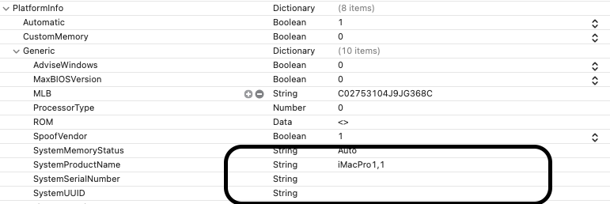

# MSI-B365M-MORTAR-9100F-RX570-HACKINTOSH-OPENCORE-EFI
OpenCore EFI / MSI B365M MORTAR - CPU i3 9100F - VGA RX570 Hackintosh 

## EFI 
iMacPro1,1

Note: Please update your SerialNumber and UUID

## Hardware
* Main: MSI B365M Mortar - 
* CPU: i3 9100F
* RAM: 2 x 8GB DDR4 2666MHz
* VGA: RX570 8GB
* Ethernet: Intel I219 (built-in card)
* TBD

## Update
#### 2021.07.30
* OpenCore v0.71
* macOS 12 Monterey
